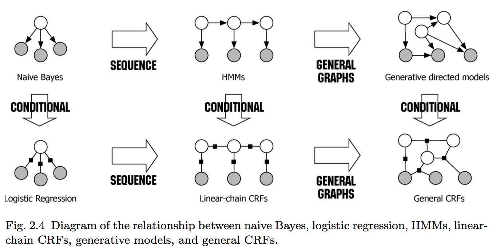

### NOTE

+ 当前互联网公司广告、搜索、推荐等都常用的 **LR、FM(Factorization Machine)、GBDT** 等，把原理搞透彻，例如LR的各种优化算法，FM的优化算法，传统GBDT和XGBOOST的原理区别等
+ [机器学习防止过拟合的方法](https://www.zhihu.com/question/59201590)
+ [GBDT与AdaBoost区别](https://www.zhihu.com/question/54626685)
+ [GBDT与XGboost区别]()
+ [集成模型GDBT与RandomForest效果好的原因](https://www.zhihu.com/question/51818176)
+ [SVD vs. PCA](https://www.zhihu.com/question/38319536)
  + SVD是PCA的另一种algebraic formulation,这也提供了另外一种算法来计算PCA
+ 为什么逻辑回归的优化目标是最大似然函数而不是均方差？
  + 个人总结：问题是一个二分类问题，y满足伯努利分布，而不是正太分布，可以参考Wikipedia-loss function for classification!
  + 参考[知乎帖](https://www.zhihu.com/question/24900876)
+ 数据不平衡怎么处理？
  + 基本思路：过采样，欠采样
+ k-means的目标函数->参考ML Techniques Taipei slides
+ GBDT+LR如何实现广告CTR预估->refer to[Practical Lessons from Predicting Clicks on Ads at Facebook](https://pdfs.semanticscholar.org/daf9/ed5dc6c6bad5367d7fd8561527da30e9b8dd.pdf)
+ Naive Bayes vs. Logistic Regression:
  + The difference between naive Bayes and logistic regression is due only to the fact that the first is generative and the second discriminative; the two classifiers are, for discrete input, identical in all other respects.
  + Naive Bayes is to Logistic Regression what HMM is to CRF, as the following picture shows,
  
+ SVM和LR区别
  + [Linear SVM和LR区别](https://www.zhihu.com/question/26768865)
+ [Hadoop实现K-means算法](http://blog.csdn.net/nwpuwyk/article/details/29564249)
+ [频率学派和贝叶斯学派有什么不同？](https://www.zhihu.com/question/20587681)
+ [如何理解95%置信区间](https://www.zhihu.com/question/26419030)
+ [详细解析损失函数正则化与贝叶斯方法的因缘](https://zhuanlan.zhihu.com/p/20620638)
+ [LR为什么要用sigmoid函数](https://www.zhihu.com/question/35322351) [指数族分布与广义线性模型](http://blog.csdn.net/u011467621/article/details/48197943)
+ LR和SVM使用情况
  * 如果Feature的数量很大，跟样本数量差不多，这时候选用LR或者是Linear Kernel的SVM
  * 如果Feature的数量比较小，样本数量一般，不算大也不算小，选用SVM+Gaussian Kernel
  * 如果Feature的数量比较小，而样本数量很多，需要手工添加一些feature变成第一种情况
+ [CTR预估一般采用LR+连续特征离散化,连续特征离散化的作用是什么?](https://www.zhihu.com/question/31989952)
  + LR一般和特征工程紧密联系在一起
  + [对于特征离散化，特征交叉，连续特征离散化非常经典的解释](http://blog.csdn.net/lujiandong1/article/details/52412123)
+ FM[Factorization Machine]
  + [1](https://tech.meituan.com/deep-understanding-of-ffm-principles-and-practices.html#mjx-eqn-eqfm)
  + [2](https://tracholar.github.io/machine-learning/2017/03/10/factorization-machine.html)
+ 推荐算法
  + 基于内容的推荐算法:用户喜欢和自己关注过的Item在内容上类似的Item
  + 协同过滤:用户喜欢那些具有相似兴趣的用户喜欢过的商品
    + 基于用户的协同过滤
    + 基于Item的协同过滤算法
    + 基于模型的协同过滤算法
      + SVD
      + MF
+ [为什么LR要用对数似然，为什么不用平方损失或者差的绝对值之类的损失]（面试官说就是为了得到凸函数）
  - [怎么从通俗意义上理解逻辑回归的损失函数？](https://www.zhihu.com/question/47744216?from=profile_question_card)

+ [为什么一些机器学习模型需要对数据进行归一化](http://www.cnblogs.com/LBSer/p/4440590.html)
  - [处理数据时不进行归一化会有什么影响？归一化的作用是什么？什么时候需要归一化？有哪些归一化的方法？](https://www.zhihu.com/question/20455227)

+ [K-means中的K如何确定?](https://www.zhihu.com/question/29208148/answer/43812335)

+ 如何判断一张图像是否是模糊的
  - 将图像与一个模糊核（点扩散函数）做卷积，然后和原来的图像作对比，如果变化较大，说明原来图像是清晰的。

+ Random Forest和SVM的使用场景
  - SVM在动辄超高维的文本分类问题中特别受欢迎，可惜内存消耗大，难以解释，运行和调参也有些烦人。而随机森林却刚好避开了这些缺点，比较实用

+ 朴素贝叶斯，这里有一个问题独立概率现实生活中不一定成立，为什么贝叶斯还是很好的（？）
+ 如何快速的求1亿张图像中相似的图片(?)
+ SVM
  + SVM在什么情况下效果会比较差？(?)
+ PCA在什么情况下可以使用？(?)
+ [机器学习自测题](http://nooverfit.com/wp/12-%E6%9C%BA%E5%99%A8%E5%AD%A6%E4%B9%A0%E8%83%BD%E5%8A%9B%E8%87%AA%E6%B5%8B%E9%A2%98-%E7%9C%8B%E7%9C%8B%E4%BD%A0%E7%9A%84%E6%9C%BA%E5%99%A8%E5%AD%A6%E4%B9%A0%E7%9F%A5%E8%AF%86%E8%83%BD%E6%89%93/) (to do?)
+ 怎么在online training下模拟bootstrap的过程(仔细读过Breiman的论文都会知道）(?)
+ MCMC(?)

+ 关于**时间序列**的卡尔曼滤波算法，HMM算法，波兹曼机等。——其中HMM适合做语音。?
